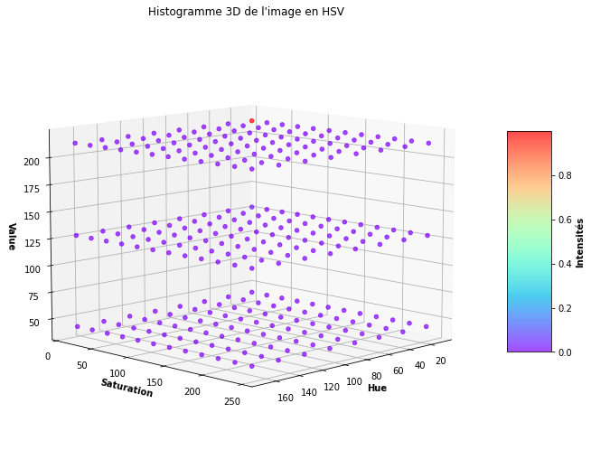

# Limites du moteur CBIR

A cause de la compression Twitter et **surtout** du fait qu'il utilise uniquement le modèle des histogrammes (Pour extraire les vecteurs des images), le moteur CBIR a du mal avec les images très claires, comme par exemple les "linearts" ou les "sketchs", c'est à dire les images en noir et blanc.

Grace au double calcul de distances (Khi-Deux et Bhattacharyya / Hellinger), si on donne au moteur une image de requête en couleur, il ne va pas sortir d'image en noir et blanc. En revanche, il peut avoir du mal avec une image de requête en noir et blanc.

D'où l'intérêt de l'étape 4 (Filtrage des résultats). Même si cette étape a aussi du mal.

Il y a donc de grandes améliorations à faire, au point de pouvoir supprimer l'étape 4.

**Note :** L'étape 4 a été supprimée le 27 septembre 2021, après le changement du moteur CBIR.

## Histogramme 3D d'une image en noir et blanc

Le problème saute aux yeux. En effet, en noir et blanc, seul "Value" change. Et comme on l'a mis sur seulement 3 échantillons, et que les images sont plus souvent claires, tout est sur un seul échantillon de l'histogramme 3D.

Ce qui nous sauve un peu, c'est qu'on fait 5 histogrammes 3D par image (Dans 5 zones différentes)
