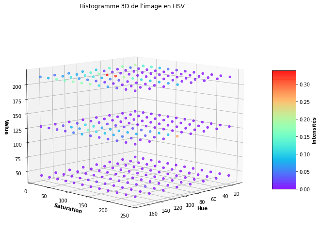

# Module Moteur CBIR

Ceci est l'ancien moteur de recherche par image d'AOTF, qui utilise la méthode des histogrammes colorimétriques pour extraire le vecteur des caractéristiques d'une image.

Il a été utilisé depuis le début d'AOTF (Premier commit le 1er juillet 2020), jusqu'à son remplacement le 26 septembre 2021.

Le gros problème de ce moteur est que l'histogramme colorométique prenait beaucoup de place, souvent vide, notamment pour les images avec "peu de données" (Très claires). De plus; la recherche par image menait à beaucou de faux positifs. C'est pour cela qu'un thread numéro 4 a existé dans le pipeline des requêtes utilisateurs, permettant de vérifier avec un algorithme de comparaison directe des images, ce qui ajoutait une étape de plus très lourde.

Il a été remplacé par le moteur actuel, qui utilise la méthode des empreintes d'images ("image hash").

Le document [`Limites_du_moteur_CBIR.md`](Limites_du_moteur_CBIR.md) était présent dans la documentation pour expliquer les limites de ce moteur.

___

Il n'existe pas de librairie pour faire du Content-Based Image Retrieval (CBIR) en Python. J'ai donc été obligé de faire mon propre système, en utilisant de préférence OpenCV afin qu'il aille plus vite.

Comme le but de ce projet est plus grand que le moteur de CBIR, je me suis basé sur l'article "The complete guide to building an image search engine with Python and OpenCV", écrit par Adrian Rosebrock, et présenté sur le site www.pyimagesearch.com. Une partie des codes de cet article sont réutilisés ici, notamment l'objet ColorDescriptor qui est presque entièrement tiré de cet article.

https://www.pyimagesearch.com/2014/12/01/complete-guide-building-image-search-engine-python-opencv/


## Utilisation indépendante de ce module

Il est possible d'utiliser ce module indépendamment du reste du projet.

**Attention : Ce module ne gère pas de base de données !**
C'est la classe `CBIR_Engine_with_Database` qui fait le lien entre le moteur CBIR et la base de données.
*Note : Cette classe n'existe plus aujourd'hui, elle a été séparée en plusieurs classes dans le module `tweet_finder`.*

### Importation et initialisation

Il faut d'abord importer l'objet `CBIR_Engine` de ce module, puis l'initialiser :
```
from cbir_engine import CBIR_Engine

engine = CBIR_Engine()
```

### Format des images

Ce module analyse des images représentés par des objets `numpy.ndarray`.

Le module `utils` contient la fonction `url_to_cv2_image` permettant d'importer n'importe quelle image depuis le web et de la convertir dans ce format.

### Indexation (Extraction de caractéristiques)

Pour obtenir la liste des caractéristiques ("feature vector") d'une image :
```
engine.index_cbir( image )
```
Avec `image` l'image à indexer, sous la forme d'un objet `numpy.ndarray`.

Cette fonction retourne alors une liste de réels.

### Recherche d'image inversée

Pour chercher une image à partir d'une autre :
```
engine.index_cbir( image, images_iterator )
```
Avec :
* `image` l'image de requête, sous la forme d'un objet `numpy.ndarray`,
* Et `images_iterator` un itérateur sur la base de données d'images indexées. Cet itérateur doit renvoyer des objets représentants les images indexés. Ces objets doivent contenir les deux attributs suivants :
  - `image_features` : La liste des caractéristiques de l'image, sous la forme d'une liste de réels,
  - `identifier` : Un identifiant unique à cette image, qui sera retourné si ses caractéristiques correspondent à l'image de requête.

Cette fonction retourne alors une liste d'identifiants d'images.

C'est la classe `Image_in_DB` du module `database` qui représente une image indexée.
De plus, il y a dans ce module `database` un exemple d'itérateur.


## Fonctionnement de la liste des caractéristiques

Pour chaque image, on calcul une liste de caractéristiques. Cette liste contient des nombres décimaux compris entre 0 et 1. Ces nombres représentent 5 histogrammes 3D.

Un histogramme 3D sur une image contient l'intensité pour plusieurs échantillons des 3 canaux des images. Ici, on traite les images en HSV, et non en RGB.
Attention, ce n'est pas l'image qu'on échantillonne, mais les 3 composantes de HSV. Ainsi, l'histogramme a 4 dimensions !

Il est possible de visualiser l'histogramme 3D d'images avec la fonction `plot_histogram()`.
Attention, il est impossible d'afficher un véritable histogramme 3D. En effet, cela reviendrait à représenter des cubes de couleurs variants avec l'intensité, mais les cubes extérieurs masqueraient les cubes intérieurs. C'est pour cela que cette fonction affiche des points à la place de cubes.

Le Notebook Jupyter `plot_histogram.ipynb` permet d'afficher l'histogramme et le tourner dynamiquement.

Exemple avec l'image suivante : https://danbooru.donmai.us/posts/4307427


