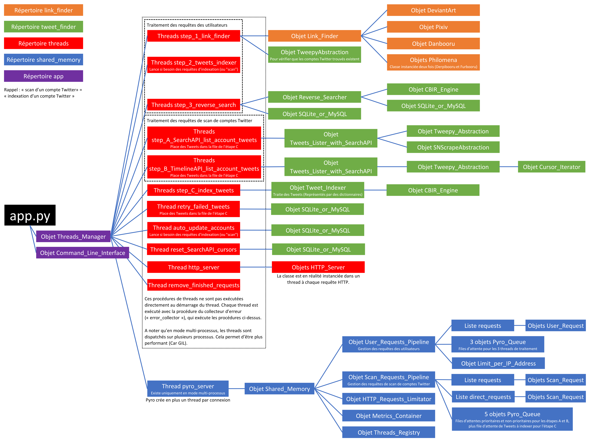

# Artists on Twitter Finder : Serveur

Le serveur de "Artists on Twitter Finder" exécute tout le traitement des requêtes, et gère sa base de données.
Il possède une API HTTP pour recevoir les requêtes, et y répondre.
Lorsqu'il est démarré, il affiche une interface en ligne de commande. Tapez `help` dans cette interface pour avoir la liste des commandes disponibles.

## Installation

1. Dupliquez le fichier `parameters_sample.py` vers `parametres.py`, et configurez-le avec vos clés d'accès aux API. Il vous faut :
   - Un ou plusieurs comptes Twitter qui serviront à indexer les Tweets.
   - Un compte Twitter développeur. Pour se faire, demandez un accès développeur sur le portail suivant : https://developer.twitter.com
   - Et optionnellement un serveur MySQL (Sinon, le programme utilise SQLite).
2. Installez les librairies Python nécessaires : `pip install -r requirements.txt`

## Utilisation

1. Si vous êtes connecté en SSH sur un serveur, créez d'abord une fenêtre : `screen -S twitter`
2. Lancez le serveur : `python3 app.py`

Ceci lance le serveur et vous met en ligne de commande. Si vous souhaitez quitter la fenêtre en laissant le serveur tourner, faites `Crtl + A + D`.

## Fonctionnalités

* Base de données stockant les comptes et les Tweets.
* Moteur de calcul de caractéristiques d'une image (Moteur CBIR).
* Parallélisme : 2 pipelines de traitement, divisés en étapes séparés dans des threads de traitement, avec files d'attentes :
  - Traitement des requêtes des utilisateurs, en 4 étapes, exécutées l'une après l'autres. Voir `app/user_pipeline`.
  - Traitement des requêtes d'indexation / de scan d'un comte Twitter, en 4 étapes paralléles. Voir `app/scan_pipeline`.
* Traitement des requêtes des utilisateurs en 4 étapes :
  - Link Finder : Recherche des comptes Twitter de l'artiste, et recherche du fichier de l'illustration. Classe principale : `Link_Finder`, dans le module `link_finder`.
  - Tweets Indexer : Lancement de l'indexation / du scan des comptes Twitter trouvés dans l'autre pipeline, et surveillance de l'avancement de ce traitement.
  - Recherche inversée d'image. Classe principale : `Reverse_Searcher`, dans le module `tweet_finder`.
  - Filtrage des résultats de la recherche inversée, car il peut y avoir des faux positifs.
* Traitement des requêtes de scan en 4 étapes paralléles (Module `tweet_finder`) :
  - API de recherche : Listage des Tweets des comptes Twitter trouvés. Classe principale : `Tweets_Lister_with_SearchAPI`.
  - API de recherche : Analyse et indexation des Tweets trouvés. L'analyse consiste au calcul des caractéristiques de l'image avec le moteur CBIR. Classe principale : `Tweets_Indexer` (Utilisée aussi pour l'API de timeline).
  - API de timeline : Listage des Tweets des comptes Twitter trouvés. Classe principale : `Tweets_Lister_with_TimelineAPI`.
  - API de timeline : Analyse et indexation des Tweets des comptes Twitter trouvés. Classe principale : `Tweets_Indexer` (Utilisée aussi pour l'API de recherche).
  - Voir pourquoi il y a deux systèmes d'indexation, soit deux API utilisées, dans `../doc/Limites_de_scan_des_comptes_Twitter.md`. Pour faire simple : L'API de timeline est limitée aux 3 200 Tweets les plus récents des comptes à indexer (Retweets inclus), et l'API de recherche est limité à ce que Twitter indexent dans leur recherche. Utiliser les deux API permet d'être le plus exhaustif possible lors de l'indexation des comptes qui ont plus de 3 200 Tweets.
* Serveur web pour l'API HTTP qui renvoit les status des requêtes, avec les éventuels résultats, ou une erreur s'il y a un problème. Voir `doc/API_HTTP.md`.
* Possibilité de lancer en mode multi-processus (`ENABLE_MULTIPROCESSING`), plus lourd mais plus efficace pour traiter des requêtes (Des utilisateurs et de scans) en paralléle.
* Mémoire partagée entre tous les threads dans l'objet `Shared_Memory` du module `shared_memory` (Avec la librairie Pyro4 si démarré en mode multi-processus).
* Limite du nombre de requête en cours de traitement par adresse IP.
* Thread de délestage automatique des anciennes requêtes terminées.
* Thread de lancement de mises à jour automatiques des comptes Twitter dans la base de données. Essaye au maximum de répartir les mises à jour dans le temps.
* Thread de retentative d'indexation de Tweets dont au moins une image a échouée (Et que cette erreur n'est pas identifiée comme insolvable dans le code, voir `get_tweet_image()`).
* Thread de suppression des curseurs d'indexation avec l'API de recherche, car l'indexation sur le moteur de recherche de Twitter est très fluctuante. Comme le thread de mise à jour, essaye au maximum de répartir les lancement d'indexations dans le temps.
* Collecteur d'erreurs : Tous les threads sont éxécuté dans une instance du collecteur d'erreurs. Stocke l'erreur dans un fichier, met l'éventuelle requête en cours de traitement en situation d'erreur / échec, et redémarre le thread.

## Architecture du code

Script `app.py` : Script central, crée et gère les threads de traitement, la ligne de commande, les files d'attentes des requêtes, et le serveur HTTP.

* Module `app` : Dépendances du script `app.py`. Contient les procédures de ses threads, et ses classes. Voir le `README.md` de ce module pour plus de détails.
  - Module `user_pipeline` : Pipeline de traitement des requêtes utilisateurs, en 4 étapes : Link Finder, lancement si nécessaire et suivi du scan du ou des comptes Twitter dans l'autre pipeline, recherche inversée de l'image de requête, et filtrage des résultats de cette recherche.
  - Module `scan_pipeline` : Pipeline de traitement des requêtes de scan d'un compte Twitter, en 4 étapes paralléles.

* Module `shared_memory` : Mémoire partagée dans un serveur, permet le multi-processing et de faire potentiellement un système distribué.
  Peut être utilisée comme un serveur PYRO (Indispensable au multi-processus), ou sinon comme un simple objet Python.

* Module `tweet_finder`, contenant plusieurs classes : Moteur de recherche d'image par le contenu pour des comptes Twitter et des Tweets. Gère le stockage et la recherche d'image inversée.
  - Module `utils`: Contient un outil pour la classe ci-dessus.
  - Module `cbir_engine` : Contient les classes du moteur de recherche d'image par le contenu. Voir le `README.md` de ce module pour plus de détails.
  - Module `database` : Contient les classes de gestion et d'accès à la base de données.
  - Module `twitter` : Contient les classe d'abstraction aux librairies qui permettent d'utiliser les API Twitter.

* Module `link_finder`, classe `Link_Finder` : Classe centrale de la partie Link Finder. Permet de trouver les URL des images et les noms des comptes Twitter des artistes.
  - Module `supported_websites` : Contient une classe pour chaque site supporté. Voir le `README.md` de ce module pour plus de détails.
    - Module `utils` : Contient des outils pour les classes ci-dessus.

## Architecture à l'exécution

## Notes

* Les requêtes sur le serveur sont identifiées par l'URL de l'illustration de requête.

* Lorsque l'on parle de l'URL d'une requête, ou de l'URL d'une illustration, on parle de l'**URL de la page web** qui contient l'illustration, et non l'URL menant directement à l'image.
  Exemple :
  - Ceci est une URL d'illustration, elle peut être traitée par le serveur : https://danbooru.donmai.us/posts/3991989
  - Ceci est une URL menant directement à l'image, elle sera rejetée par serveur : https://danbooru.donmai.us/data/__hatsune_miku_vocaloid_drawn_by_bibboss39__cac99a60fa84a778d5b048daec05e7b1.jpg

* La date de dernière mise à jour d'un compte Twitter est mise dans la base de données à la fin des 2 étapes d'indexation (Indexation avec l'API de recherche et indexation avec l'API de timeline). Si l'un des threads de traitement plante, la requête est mise en erreur, et aucune date n'est enregistrée. Ainsi, l'intégralité des Tweets qu'il est possible de récupérer ont étés analysés et ceux avec une ou plusieurs image sont dans la base de données.

* Si l'image d'un Tweet a été perdue par Twitter, ou qu'il s'est produit une erreur, elle est de toutes manières enregistrée dans la base de données, avec des `NULL` pour liste de caractéristiques.
  Si il s'est produit une erreur, elle sont journalisées ici.

* Les curseurs d'indexation sont enregistrés une fois l'indexation terminée. D'une manière générale, l'ajout ou la modifications de données dans la base de données est pensé pour qu'un arrêt brutal (Crash ou kill) d'un thread ou du serveur complet n'ait pas d'impact sur la cohérence des données.
